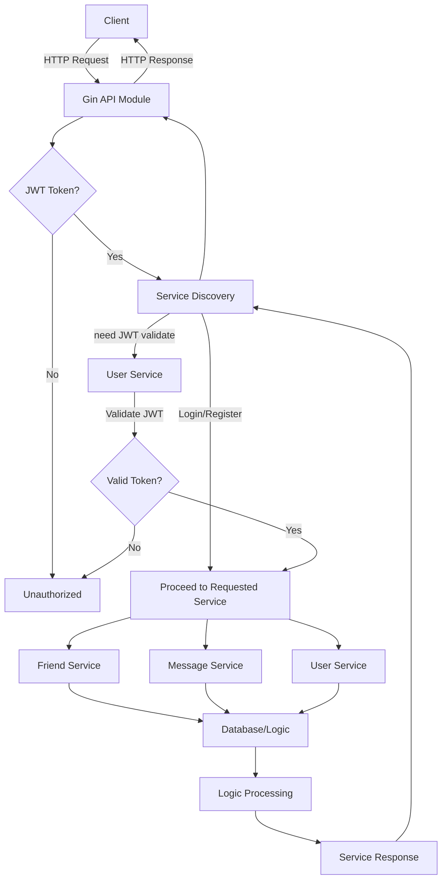

# Chat 项目

## 学习计划

1. ~~Git 常用命令~~
2. MySQL 基础使用
3. Redis 基础使用
4. ~~Golang 基础知识~~
5. Golang 框架学习(Gin Gorm Go-Zero)
6. golang 微服务相关知识
7. Golang Web 项目开发(具体信息请参考下述项目实战)
8. ~~Docker 基础~~
9. [mq](https://github.com/zeromicro/go-queue)， 使用场景
10. go-zero [组件](https://go-zero.dev/docs/reference/examples)继续学习

## TODO

logic 中的数据库交互移植 DAO 层（新建 DAO 目录）

gin 和 handler 封装成 gateway

## 项目进度

开发一个简单的聊天工具后台系统

| 服务名称 | 功能描述       | 状态 |
| -------- | -------------- | ---- |
| 用户服务 | 用户注册、登录 | ✅   |
| 消息服务 | 发送消息       | ✅   |
| 好友服务 | 添加好友       | ✅   |

### 需要采用的技术栈

1.  Golang
2.  [Gin](https://gin-gonic.com/zh-cn/docs/introduction/)作为 Web 框架
3.  [Gorm](https://gorm.io/zh_CN/docs/index.html)作为 ORM 框架
4.  [Go-Zero](https://go-zero.dev/)作为微服务框架
5.  Redis 作为缓存中间件
6.  Mysql 作为数据库
7.  依赖组件如 mysql、redis、etcd 等可以采用 docker 容器化部署

## 项目架构图

## 生成代码

`goctl rpc protoc api/proto/user.proto  --go_out=./service/user-service/pb  --go-grpc_out=./service/user-service/pb  --zrpc_out=./service/user-service`

`goctl rpc protoc api/proto/friend.proto  --go_out=./service/friend-service/pb  --go-grpc_out=./service/friend-service/pb  --zrpc_out=./service/friend-service`

`goctl rpc protoc api/proto/message.proto  --go_out=./service/message-service/pb  --go-grpc_out=./service/message-service/pb  --zrpc_out=./service/message-service`

##

依赖组件
`docker compose up -d`

构建
`make all`
