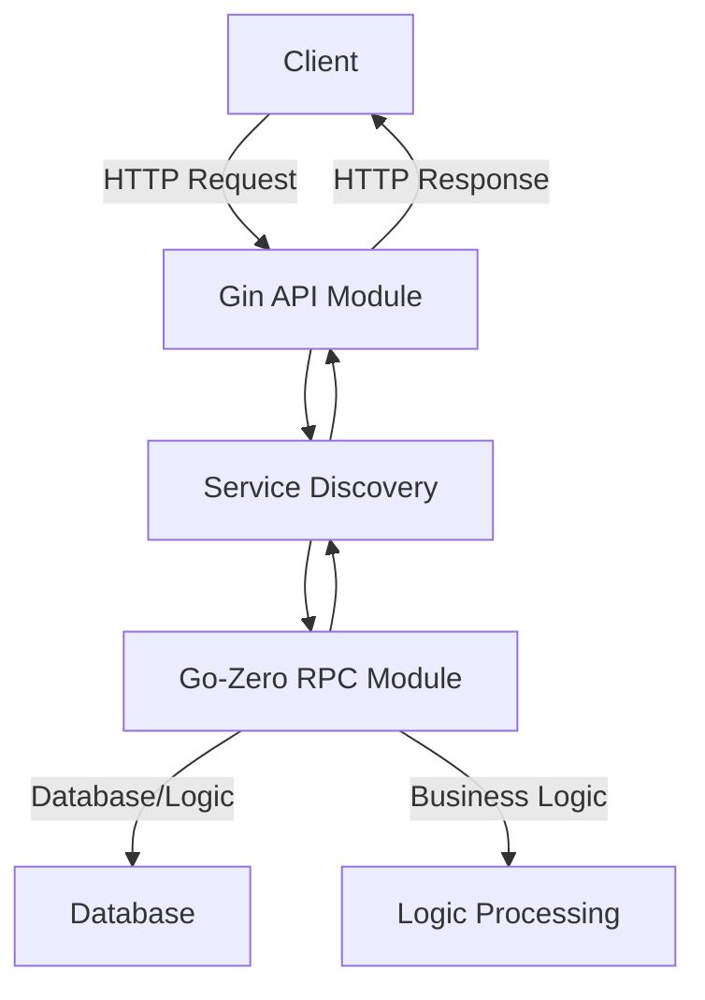

## 前置知识
1. ~~Git 常用命令~~

2. MySQL 基础使用

3. Redis 基础使用

4. ~~Golang 基础知识~~

5. Golang 框架学习(Gin Gorm Go-Zero)

6. golang微服务相关知识

7. Golang Web 项目开发(具体信息请参考下述项目实战)

8. ~~Docker 基础~~

## 项目实战:
开发一个简单的聊天工具后台系统
1. 采取微服务架构，包括但不限于用户服务、消息服务、好友服务， 仅需实现用户注册、登录、添加好友、发送消息等基本功能就行
2. 需要采用的技术栈
   1. Golang
   2. Gin作为Web框架
   3. Gorm作为ORM框架
   4. Go-Zero作为微服务框架
   5. Redis作为缓存中间件
   6. Mysql作为数据库
3. 依赖组件如mysql、redis、etcd等可以采用docker容器化部署

## 项目架构图

